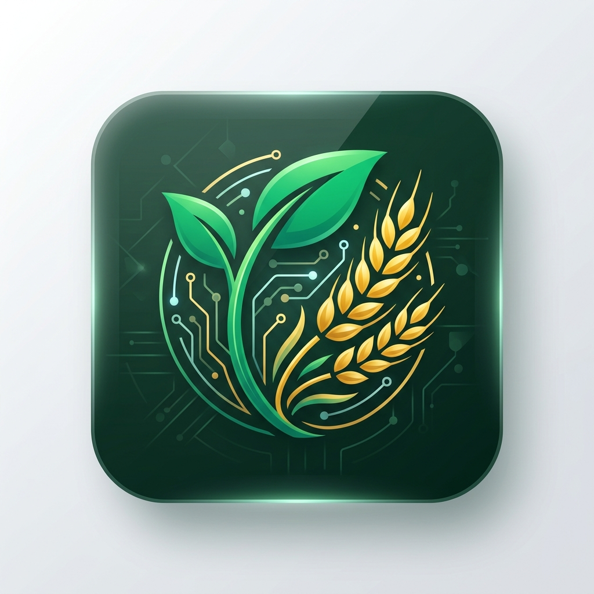

<div align="center">

  

  # 🌾 AgriSense — AI-Powered Farming Assistant

  **Smart Agricultural Decision Support for Indian Farmers**

  [](https://github.com/HarshitsinhVadher/agrisense/raw/main/AgriSense-v4.5-release.apk)
  [](https://github.com/HarshitsinhVadher/agrisense/tags)
  [](https://agrisense-app.onrender.com)
  [](LICENSE)

</div>

---

## 📌 Project Overview

**AgriSense** is a full-stack, mobile-first agricultural decision-support application built for smallholder and commercial farmers across India. It features **1:1 complete parity** between the **React Native Android Mobile App** and the **FastAPI Single-Page Web Application**.

Powered by **Google Gemini Vision & Search Grounding**, **Random Forest Machine Learning**, **Open-Meteo Weather Services**, and **Render PostgreSQL**, AgriSense translates complex agricultural datasets into actionable guidance in **Gujarati (ગુજરાતી)**, **Hindi (हिंदी)**, and **English**.

---

## ⚡ Quick Download & Access

| Platform | Access Link | Description |
|:---|:---|:---|
| 📱 **Android App (APK)** | [**Download AgriSense v4.5 APK**](https://github.com/HarshitsinhVadher/agrisense/raw/main/AgriSense-v4.5-release.apk) | Standalone release build with custom Android 8.0+ Adaptive Icons (`77.1 MB`). |
| 🌐 **Web Application** | [**agrisense-app.onrender.com**](https://agrisense-app.onrender.com) | Responsive PWA web app accessible from any smartphone or desktop browser. |
| 🏷️ **Latest Tagged Build** | [**GitHub v4.5 Release Tag**](https://github.com/HarshitsinhVadher/agrisense/tags) | Release tags, source code, and version history. |

---

## 🚀 Core Features & Capabilities

### 📱 1. Phone-Number Authentication & Profile Security
- **No Email Required**: Designed specifically for rural Indian farmers using a 10-digit mobile number + password login.
- **Registration Safeguard**: Requires entering and re-confirming the 10-digit mobile number to prevent typos during sign-up.
- **Render PostgreSQL Integration**: Connected via `DATABASE_URL` with persistent user state and masked profile cards (`📱 XXXXXXX210`).
- **Logout Confirmation**: Interactive confirmation dialog preventing accidental logouts.

### 🌱 2. 4-Layer Context Fusion Crop AI Recommender
- **Location Layer**: Automatic GPS location reverse geocoding to exact villages, talukas, and districts.
- **Soil Layer**: 5 interactive soil texture pills (`✨ Auto-Detect`, `⚫ Black Cotton`, `🏖️ Sandy Loam`, `🏞️ Alluvial`, `🔴 Red Clay`).
- **NPK Deficit Layer**: District agro-climatic baseline data auto-populating Nitrogen, Phosphorus, Potassium, and pH levels.
- **3-Month Climate Layer**: Integrates 90-day seasonal rainfall & temperature trends with Gemini AI reasoning.
- **Geographical Action Plan**: Recommends top matching crops, specific seed varieties (e.g. *Bhalia Wheat*, *Gujarat Cotton-20*, *Paddy GNR-3*), crop duration, expected yield per acre, and organic carbon/fertilizer guidance.

### 🌤️ 3. Weather, 7-Day Forecast & Advisories
- **Exact Village Reverse Geocoding**: Powered by OpenStreetMap Nominatim, displaying precise location names (e.g. *Sabarmati, Ahmedabad, Gujarat* or *Sanand, Gujarat*).
- **7-Day Weather Cards**: Real-time temperature, humidity, wind speed, rainfall, and daily weather forecast icons.
- **Agricultural Risk Advisories**: Pest warnings, frost alerts, and monsoon advisories customized for the farmer's location.

### 🏷️ 4. AI Pesticide & Fertilizer Label Scanner
- **Gemini Vision AI Analysis**: Capture or upload photos of pesticide bottles, fertilizer bags, or seed packages.
- **Fallback Chemical Database**: Includes fuzzy search across 100+ registered chemical formulations when offline or ungrounded.
- **Comprehensive Breakdown**: Displays active ingredient name, recommended dosage per acre, target crops & pests, and safety precautions.

### 🌐 5. Trilingual Localization
- Instant language switching across **Gujarati (ગુજરાતી)**, **Hindi (हिंदी)**, and **English** with complete translation of crop titles, suitability explanations, yield units (`ક્વિન્ટલ/એકર`), and UI components.

---

## 🛠️ Technology Architecture & Stack

```
                                ┌────────────────────────────────────────┐
                                │          Farmer User Client            │
                                ├───────────────────┬────────────────────┤
                                │ Android Mobile    │ Web SPA            │
                                │ (React Native)    │ (Vanilla HTML/CSS) │
                                └─────────┬─────────┴──────────┬─────────┘
                                          │                    │
                                          └──────────┬─────────┘
                                                     ▼
                                     ┌───────────────────────────────┐
                                     │     FastAPI REST Server       │
                                     │      (backend/main.py)        │
                                     └───────────────┬───────────────┘
                                                     │
         ┌───────────────────┬───────────────────────┼───────────────────────┬───────────────────┐
         ▼                   ▼                       ▼                       ▼                   ▼
┌─────────────────┐ ┌─────────────────┐ ┌─────────────────┐ ┌─────────────────┐ ┌─────────────────┐
│ Render Postgres │ │  Gemini Vision  │ │ Random Forest   │ │ OpenStreetMap   │ │  Open-Meteo     │
│ Database (Auth) │ │  AI & Grounding │ │ Crop Classifier │ │ Nominatim API   │ │  Weather Service │
└─────────────────┘ └─────────────────┘ └─────────────────┘ └─────────────────┘ └─────────────────┘
```

- **Backend REST API**: Python 3.14 + FastAPI + Uvicorn
- **AI / LLM Integration**: Google Gemini 2.0 Flash (`google-genai`) with Search Grounding
- **Machine Learning**: Scikit-Learn (Random Forest Crop Classification Model)
- **Database**: PostgreSQL (Render Cloud) with SQLite local dev fallback
- **Mobile Native**: React Native + Expo SDK + Android 8.0+ Adaptive Icons XML
- **Deployment**: Render Cloud (Web Service) + EAS / Gradle Release (APK)

---

## 📁 Repository Structure

```
agrisense/
├── backend/
│   ├── data/
│   │   ├── gujarat_agro_zones.json   # 26 district agro-climatic profiles & soil baselines
│   │   └── products_db.json          # Curated pesticide & fertilizer chemical database
│   ├── models/
│   │   ├── crop_recommender.py       # Random Forest ML model inference
│   │   └── crop_model.pkl            # Trained ML classifier model artifact
│   ├── services/
│   │   ├── ai_crop_advisor.py        # 4-Layer Context Fusion AI Engine & Translation
│   │   ├── auth_service.py           # Phone Auth, Password Hashing, PostgreSQL/SQLite DB
│   │   ├── db_service.py             # User profile & recommendation storage
│   │   ├── label_service.py          # Gemini Vision Label Scanner & chemical matcher
│   │   ├── regional_crop_lookup.py   # GPS Haversine distance district locator
│   │   └── weather_service.py        # Open-Meteo 7-day forecast & Nominatim geocoder
│   ├── main.py                       # FastAPI application routes & static file server
│   ├── Procfile                      # Render cloud deployment entrypoint
│   └── requirements.txt              # Python server dependencies
├── frontend/                         # Single-Page Web Application
│   ├── index.html                    # Responsive mobile-frame web SPA shell
│   ├── css/styles.css                # Mobile-first CSS design system & scroll containers
│   ├── js/
│   │   ├── app.js                    # SPA state coordinator & session manager
│   │   ├── translations.js           # Trilingual dictionary (GU, HI, EN)
│   │   ├── weather_ui.js             # Weather, 7-day forecast & GPS locator UI
│   │   ├── recommendation_ui.js      # Crop AI, soil selector pills & action plan UI
│   │   ├── label_scanner_ui.js       # Label scanner upload & chemical analysis UI
│   │   └── profile_ui.js             # Farmer profile & authentication manager UI
│   └── static/favicon.png            # Web application icon
├── mobile/                           # React Native Mobile App
│   ├── assets/                       # Custom AgriSense app icons & splash screens
│   ├── android/                      # Native Android project with Adaptive Icons XML
│   ├── components/CameraScanner.js   # Native camera component for label scanning
│   ├── App.js                        # Multi-tab React Native mobile application
│   ├── app.json                      # Expo application & adaptive icon configuration
│   └── package.json                  # Mobile NPM dependencies
├── AgriSense-v4.5-release.apk        # Compiled Android Release APK (77.1 MB)
├── Procfile                          # Root deployment entrypoint
└── README.md                         # Project documentation
```

---

## 💻 Local Installation & Setup

### 1. Run Backend Server Locally

```bash
# Clone the repository
git clone https://github.com/HarshitsinhVadher/agrisense.git
cd agrisense/backend

# Install dependencies
pip install -r requirements.txt

# Set Gemini API Key (Optional for live AI Vision)
$env:GEMINI_API_KEY="your_api_key_here"

# Start FastAPI dev server
python main.py
```
The backend REST server runs on `http://localhost:8000`.

### 2. Run Mobile App Locally

```bash
cd agrisense/mobile
npm install
npx expo start
```

---

## 📜 License

Distributed under the MIT License. See `LICENSE` for more details.

---

<div align="center">

  **AgriSense — Empowering Indian Agriculture with Artificial Intelligence** 🌾🤖

</div>
